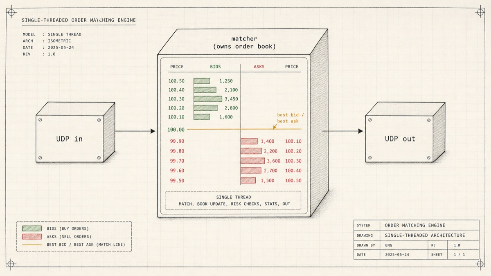

# matcher

Order-matching engine in Rust — a `BTreeMap`-backed price-time book, no locks,
no I/O. The crate also ships a reference UDP-multicast daemon that wires the
book up to the network, but that's optional.

> **Status: experimental.** API and wire format may change between commits.

Supported order types: **Market**, **Limit**, **IOC**, **FOK**, **Post-Only**,
**Iceberg**. Time-in-force is GTC only. The book is single-threaded — wrap it
in your own actor / channel / lock if you need concurrency.

---

## Library usage

```rust
use matcher::{Order, OrderBook, Side};

let mut book = OrderBook::new();

// Resting sell @ 100, qty 5.
book.submit(Order::limit(1, Side::Sell, 100, 5), 0);

// Crossing buy @ 100, qty 3 — produces one trade.
let trades = book.submit(Order::limit(2, Side::Buy, 100, 3), 1);
assert_eq!(trades.len(), 1);
assert_eq!(trades[0].price, 100);
assert_eq!(trades[0].quantity, 3);
```

If callers need the full execution stream, use the event-returning API:

```rust
use matcher::{BookEvent, Order, OrderBook, Side};

let mut book = OrderBook::new();
let events = book.submit_events(Order::limit(1, Side::Buy, 100, 5), 0);

assert_eq!(events[0], BookEvent::Accepted { order_id: 1 });
assert_eq!(events[1], BookEvent::Rested { order_id: 1, remaining: 5 });
```

```toml
[dependencies]
matcher = { git = "https://github.com/gocronx/matcher" }
```

Pull in `matcher::book` only and `tokio` / `socket2` are unused at runtime.
Other deps: `ahash`, `smallvec`.

Runnable demos live in [`examples/`](examples/):

```sh
cargo run --example basic        # minimal cross
cargo run --example events       # full BookEvent stream
cargo run --example iceberg      # iceberg refill behavior
cargo run --example order_types  # Limit / Market / IOC / FOK / PostOnly
```

---

## Design

- **Single book, no internal sharding.** If you want N products, run N books
  (or N processes) — no router, no cross-product locks, one crash = one
  product.
- **No persistence.** Restart loads an empty book; the upstream order source
  is expected to replay or snapshot. Cuts the runtime in half.
- **Library first, transport optional.** UDP, gRPC, NATS, in-process — pick
  whatever fits. The bundled UDP daemon is an example, not the contract.

---

## Reference UDP daemon

A binary at `src/bin/matcher.rs` wires the book up to two UDP multicast
groups: orders in, trades out. Three async actors connected by mpsc channels;
the book is owned by the matcher actor exclusively, no locks anywhere.



### Build & run

```sh
cargo build --release
./target/release/matcher --in 239.0.0.1:5000 --out 239.0.0.2:5001
```

`--in` / `--out` default to the values shown. Add `--iface 127.0.0.1` for
loopback-only testing (e.g. when a VPN is grabbing the multicast route).

### Wire protocol

64-byte big-endian packets. Byte 0 is the message type.

#### submit · type `1`

| offset     | field                                                          |
| ---------- | -------------------------------------------------------------- |
| `[1]`      | side (1=buy, 2=sell)                                           |
| `[2]`      | kind (1=market, 2=limit, 3=ioc, 4=fok, 5=post-only, 6=iceberg) |
| `[8..16]`  | order_id                                                       |
| `[16..24]` | price                                                          |
| `[24..32]` | total_quantity                                                 |
| `[32..40]` | iceberg_visible (0 unless iceberg)                             |

#### cancel · type `2`

| offset    | field    |
| --------- | -------- |
| `[8..16]` | order_id |

#### trade · type `3`

| offset     | field          |
| ---------- | -------------- |
| `[1]`      | aggressor side |
| `[8..16]`  | buy_id         |
| `[16..24]` | sell_id        |
| `[24..32]` | price          |
| `[32..40]` | quantity       |
| `[40..48]` | timestamp ns   |

`src/codec.rs` is the authoritative spec; `tests/smoke.rs` shows the same
path in Rust.

### Sending an order from Python

```python
import socket, struct

buf = bytearray(64)
buf[0] = 1                                # submit
buf[1] = 1                                # side: buy
buf[2] = 2                                # kind: limit
struct.pack_into(">QQQQ", buf, 8,
                 42,                      # order_id
                 100, 5, 0)               # price, total_qty, iceberg_visible

s = socket.socket(socket.AF_INET, socket.SOCK_DGRAM)
s.setsockopt(socket.IPPROTO_IP, socket.IP_MULTICAST_IF,
             socket.inet_aton("127.0.0.1"))
s.sendto(bytes(buf), ("239.0.0.1", 5000))
```

---

## Performance

Numbers from `cargo bench` on an Apple M4 (macOS 24.6, Rust release profile,
`lto = "thin"`, `codegen-units = 1`). Each row is one criterion benchmark;
"per op" divides the measured time by the work per iteration.

### Throughput micro-benchmarks (1 000-deep book)

| Benchmark                   | Median per iter | Per op   | Throughput      |
| --------------------------- | --------------- | -------- | --------------- |
| `submit_limit_no_match`     | 57.4 µs / 1k    | ~57 ns   | ~17 M limits/s  |
| `submit_market_full_sweep`  | 62.2 µs / 1k    | ~62 ns   | ~16 M trades/s  |
| `cancel_random`             | 60.4 µs / 1k    | ~60 ns   | ~17 M cancels/s |
| `cancel_same_price_stack`   | 105 µs / 1k     | ~105 ns  | ~10 M cancels/s |
| `mixed_workload_throughput` | 68.4 µs / 1k    | ~68 ns   | ~15 M ops/s     |

### Deep-book micro-benchmarks (100 000-deep book)

These use `iter_custom` so the heavy setup is excluded from the measurement.
Numbers are per single op against a fully populated book.

| Benchmark                | Per op | Notes                                |
| ------------------------ | ------ | ------------------------------------ |
| `submit_into_deep_book`  | 149 ns | One limit insert into 100 k-deep map |
| `cancel_in_deep_book`    | 147 ns | One mid-depth cancel from 100 k book |

The 1 000 → 100 000 depth jump only adds ~80–90 ns per op, consistent with
`BTreeMap`'s O(log n) growth (log₂(100k)/log₂(1k) ≈ 1.7).

### Per-op latency distribution

`cargo run --release --example latency_dist` runs 200 000 deterministic
mixed ops (80 % submit / 15 % cancel / 5 % market-sweep) and prints the
percentile breakdown:

| Percentile  | Latency   |
| ----------- | --------- |
| p50         | 83 ns     |
| p90         | 209 ns    |
| p95         | 292 ns    |
| p99         | 750 ns    |
| p99.9       | 1 709 ns  |
| max         | ~111 µs   |
| **end-to-end throughput** | **~7.4 M ops/s** |

Each sample includes one `Instant::now()` call's overhead (~20-40 ns),
so absolute numbers are upper bounds. The single max outlier (~111 µs)
is a typical OS scheduler / page-fault spike; medians and p99 are stable
across runs.

### What each benchmark measures

- **submit_limit_no_match** — 1 000 fresh non-crossing limits into an empty
  book. Pure level-insertion, no matching.
- **submit_market_full_sweep** — pre-fill 1 000 resting sells at distinct
  prices, then one market buy that sweeps all of them and produces 1 000
  trades. Stresses the matching loop end-to-end.
- **cancel_random** — pre-fill 1 000 limits at distinct prices, cancel each
  in random order. Each cancel sits at its own level → BTreeMap dominates.
- **cancel_same_price_stack** — 1 000 orders at the **same** price level,
  cancelled in random order. Worst case for `PriceLevel::remove`'s O(n)
  linear scan; total work is O(n²).
- **submit_into_deep_book / cancel_in_deep_book** — 100 000 resting orders,
  measure one op. Captures BTreeMap + cache behavior at scale.
- **mixed_workload_throughput** — 1 000-step LCG-driven 80/15/5 mix.
  Closer to real market flow than the targeted micro-benches.

Reproduce with:

```sh
cargo bench
cargo run --release --example latency_dist
```

Numbers are intended as a regression baseline, not a marketing claim — your
hardware, kernel, and workload will differ. The single-threaded book design
means throughput scales by running multiple books, not by adding cores to one.

---

## Testing

```sh
cargo test
```
