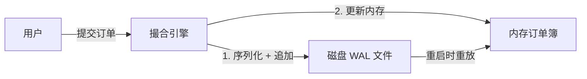

# WAL (Write-Ahead Logging) 持久化设计方案

## 1. 目标
为 `matcher` 引擎提供数据持久化能力，确保：
- **故障恢复**：系统崩溃重启后，能完全恢复订单簿状态。
- **高吞吐**：采用二进制追加写入模式，对撮合性能影响最小化。
- **简单可靠**：设计简单，易于理解和验证。

## 2. 架构设计

### 2.1 数据流


### 2.2 日志结构 (LogEntry)

使用 `LogEntry` 枚举定义所有会导致状态变更的操作：

```rust
use serde::{Deserialize, Serialize};
use crate::types::{Order, OrderId, ProductId};

#[derive(Serialize, Deserialize, Debug)]
pub enum LogEntry {
    /// 提交新订单
    PlaceOrder(Order),
    /// 取消订单
    CancelOrder(OrderId, ProductId),
    // 未来可以扩展：
    // FlushSnapshot(u64) // 快照点
}
```

### 2.3 文件格式
WAL 文件采用简单的二进制流格式，方便追加和顺序读取。使用 `bincode` 进行序列化。

所有写入都经过 `BufWriter` 缓冲，以减少系统调用次数。

**文件布局：**
`[SequenceID (u64)] [Entry Length (u64)] [Bincode Serialized Data] ...`

*注：为了简化 V1 实现，我们可能先只存储没有任何 header 的纯 `bincode` 序列，依赖 `bincode` 的 `deserialize_from` 自动处理流。但为了稳健性，增加长度前缀是更好的实践。*

### 2.4 组件设计

#### `WalManager`
负责底层的磁盘文件操作。

- `new(path: PathBuf) -> Result<Self>`: 打开或创建日志文件。
- `append(entry: &LogEntry) -> Result<()>`: 将日志条目追加到文件尾部。
- `replay() -> Result<Vec<LogEntry>>`: 读取所有日志条目用于恢复。
- `flush() -> Result<()>`: 强制刷盘（可配置）。

#### `MatchingEngine` 集成
在 `MatchingEngine` 中持有 `WalManager` 的引用（用 `Arc<Mutex<WalManager>>` 或类似机制）。

- **Submit Order**:
  1. 接收 Order。
  2. 构造 `LogEntry::PlaceOrder(order)`。
  3. 调用 `wal.append(&entry)`。
  4. 成功后，执行内存撮合。
  
- **Cancel Order**:
  1. 接收 Cancel 请求。
  2. 构造 `LogEntry::CancelOrder(id)`。
  3. 调用 `wal.append(&entry)`。
  4. 成功后，执行内存取消。

## 3. 实现计划

### 3.1 引入依赖
- `bincode`: 高性能二进制序列化。
- `serde`: 序列化支持（已有）。

### 3.2 模块实现
创建 `src/storage` 模块，包含 `wal.rs`。

### 3.3 引擎集成
修改 `MatchingEngine`：
- `new`: 初始化 WAL，如果存在旧日志则进行重放。
- `submit_order`: 插入 WAL 写入逻辑。
- `cancel_order`: 插入 WAL 写入逻辑。

### 3.4 恢复逻辑
在系统启动时，按顺序重放日志：
- 这里需要注意：重放时不应再次写入 WAL。需要将“处理订单”的逻辑从“接收外部请求”的逻辑中拆分出来，或者增加一个标志位 `is_replay`。

## 4. 性能考量

- **I/O 缓冲**：使用 `BufWriter` 避免每次小写操作都触发 syscall。
- **异步 vs 同步**：
  - 为了保证严格的数据一致性（Durability），通常需要在返回用户成功前 `wsync`。这会极大降低吞吐量。
  - 为了性能平衡，我们通常依赖 OS 的 Page Cache，定期 flush。
  - 在 `matcher` 的异步架构中，我们可以将 WAL 写入放在当前线程（可能会阻塞极短时间），或者使用单独的 WAL 线程（更复杂）。
  - **V1 方案**：在当前线程同步写入 `BufWriter`。这在 SSD 上通常非常快，且不需要复杂的跨线程同步。

## 5. 局限性 (V1)
- 还没有实现 Snapshot（快照）。如果系统运行很久，日志会无限增长，导致恢复时间过长。
- 只有 Append-only 日志，没有日志切分和清理。
- *解决方案*：后续版本引入 Snapshot 机制，定期将内存状态 dump 到磁盘，并截断旧日志。
